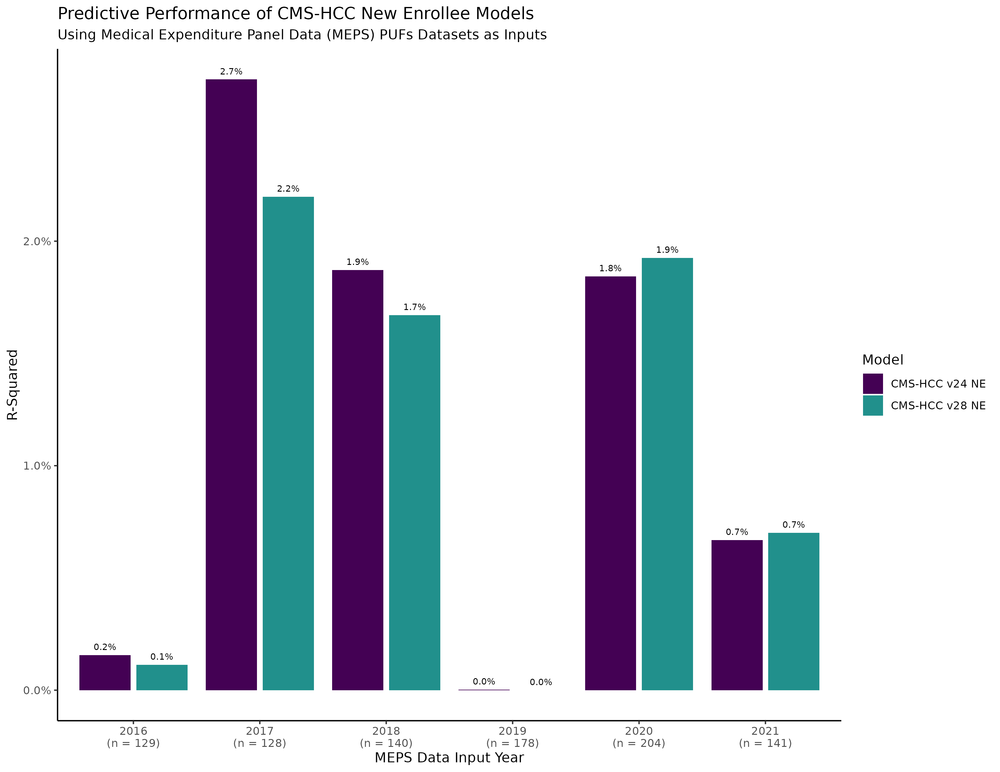
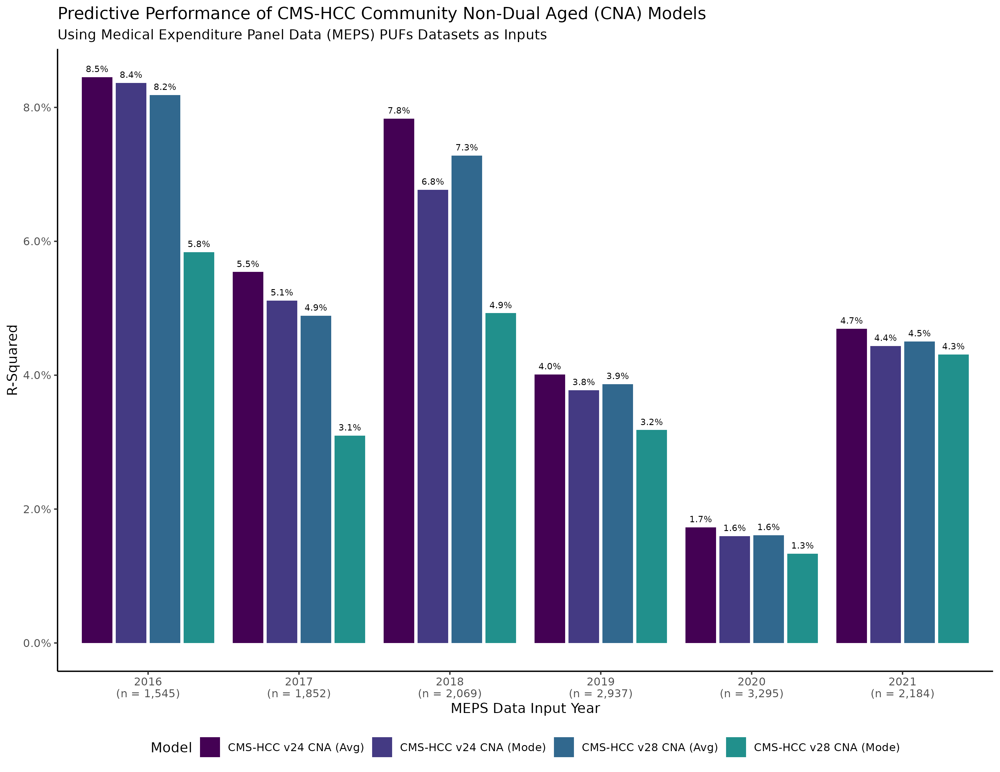
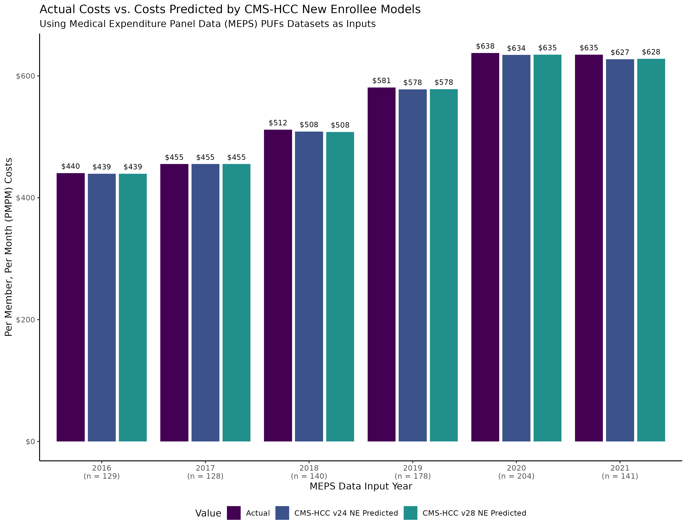
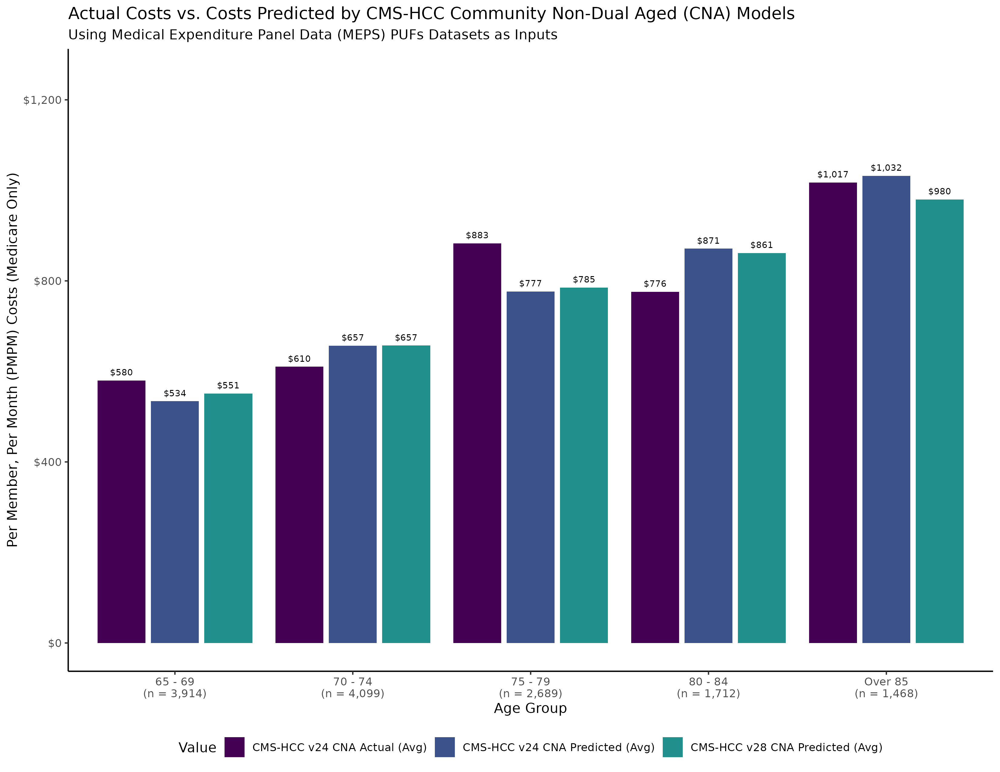
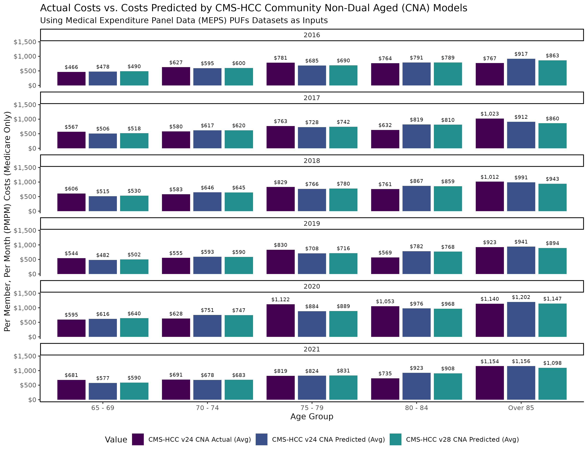

# hcc-meps
Process to apply HHS-HCC model scores to MEPS respondent data from 2016 - 2022. This writeup is very incomplete and a work in progress.

# Overview & Purpose
It would be nice to have a set of prospective risk scores from a well-used and trusted RA model to go alongside other analyses of MEPS data. Typically, risk scores are only available with administrative claims data, which does not tend to include information about socioeconomic factors like income, race, ethnicity, biometric observations, or SDoH information.  

However, MEPS has most of the information required to risk adjust its respondent population using the CMS-HCC models. Furthermore, the CMS-HCC risk scores are quite predictive of future year costs for this population. This allows for expedited anlyses using MEPS data with a single risk score that encapsulates expected costs and quantifies health status for the Non-Dual Aged Medicare population.

# Preparation of MEPS Data Sources
Coming soon.

# Is it Predictive?
Yes!

# Process Flow Overview

meps-prep.R = load files from MEPS and preprocess for HCC and elixhauser score models
ahrq-ccsr-prep.R = load CCSR crosswalks and appropriately crossmap ICD10CM codes to CCSR
icd10-freq-prep.R = load ICD10CM frequency files from the state of California
cms-hcc-run.R = Load supporting functions to load the Python venv to run CMS-HCC models via hccpy package
hhs-hcc-run.R = Load supporting functions to load the Python venv to run HHS-HCC models via hccpy package
elix.R = Load supporting functions to load the Python 

