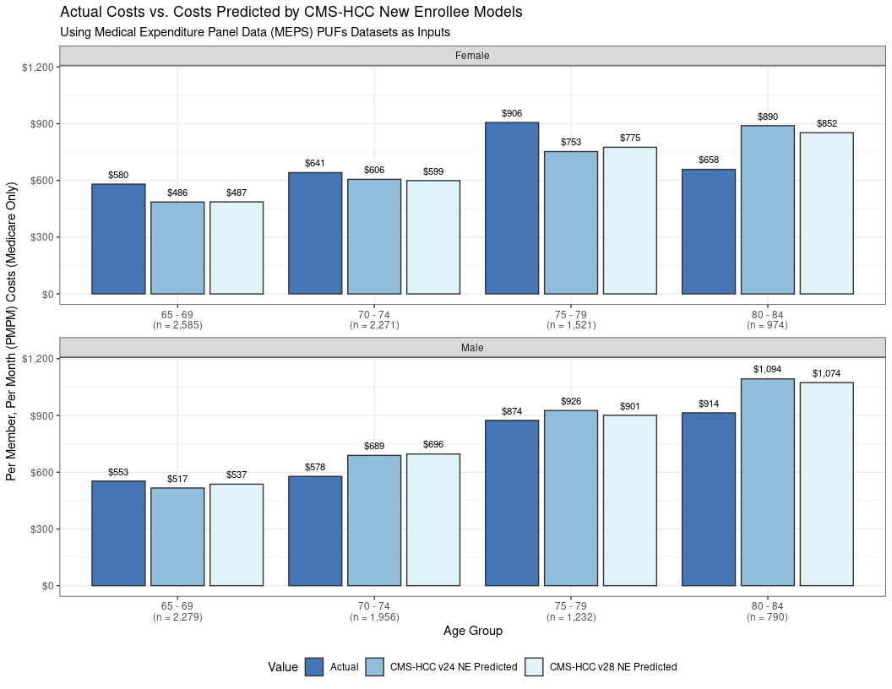
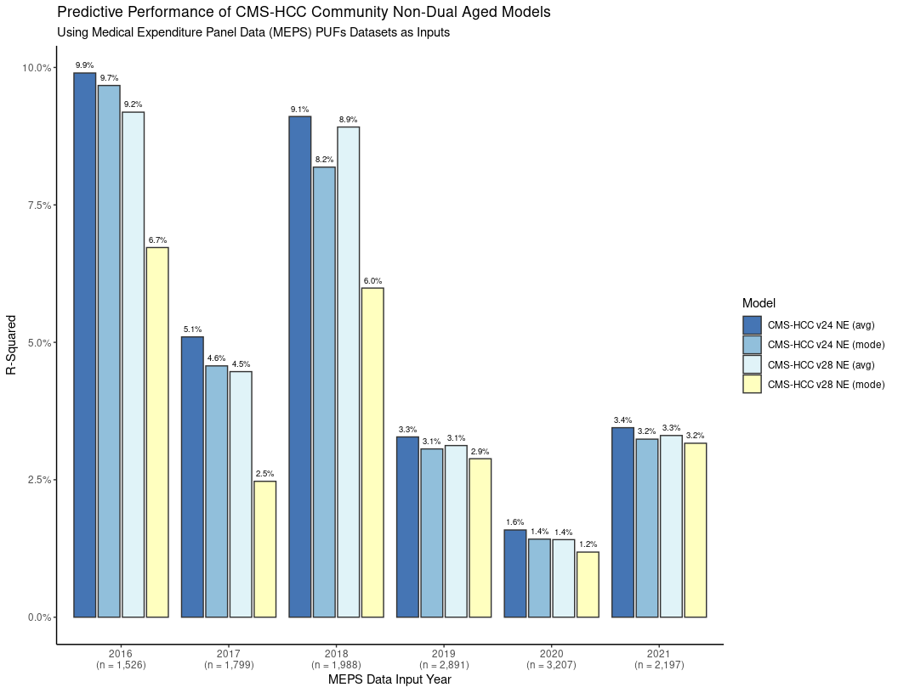

CMS-HCC on MEPS
================
C. Seth Lester, ASA, MAAA (<cslester@gmail.com>)  
29 September 2024 (nonfinal version)

# Project Overview

The code in this repository applies the CMS-HCC risk adjustment model to
data from the Medical Expenditure Panel Survey (MEPS) Public Use Files
(PUFs) for the years 2016 - 2022.

## What is Risk Adjustment in Healthcare?

Healthcare risk adjustment models, such as the CMS-HCC risk adjustment
model, are designed to take administrative healthcare claims data for
the current year as inputs and produce individual-level risk scores as
outputs. The risk score output for each individual processed by the
CMS-HCC model is designed to be highly correlated with that individual’s
total costs to the Medicare program in the subsequent year.

## What is the CMS-HCC model used for?

The CMS-HCC model is used to adjust payments to Medicare Advantage plans
based on the health status and demographic characteristics of enrollees,
ensuring that plans are compensated fairly for taking on higher-risk
patients. Without such a risk adjustment-based reimbursement model,
Medicare Advantage plans would be incentivized against enrolling
high-risk patients or those members more generally in need of costly
healthcare services, such as members with pre-existing (but manageable)
chronic conditions like diabetes, high blood pressure, or asthma.

On the contrary, one could argue that this reimbursement model
over-incentivizes Medicare Advantage plans to take on high-risk patients
[(or potentially report diagnoses in patients that may bend the truth,
so that they appear to be
high-risk)](https://www.wsj.com/health/healthcare/medicare-health-insurance-diagnosis-payments-b4d99a5d),
but this is a contentious discussion, and this repository is not the
place for it.

## What else can the CMS-HCC model be used for?

Beyond adjusting payments to Medicare Advantage plans, the CMS-HCC model
is often used for other analytical purposes:

- **Projecting Future Costs**: Organizations frequently apply the
  CMS-HCC model to claims data to project future costs, even when not
  directly tied to reimbursement. For example, a Medicare Advantage plan
  might use these prospective risk scores to project costs for their
  enrollee population in the coming year. *Vignette coming soon!*

- **Controlling for Clinical Risk in Observational Studies**: The
  CMS-HCC risk adjuster is also used in observational studies to control
  for or quantify clinical risk differences between two populations,
  such as treatment and control groups. Since the CMS-HCC model is
  trained prospectively on costs incurred in the following year, it is
  particularly useful for calculating average treatment effects in terms
  of ROI or dollars saved by some program, intervention, or social
  disparity experienced by the treatment population and not experienced
  by the control population. *Vignette coming soon!*

## Why MEPS?

The Medical Expenditure Panel Survey (MEPS) is [widely used in health
outcomes and effectiveness
studies](https://meps.ahrq.gov/mepsweb/data_stats/publications.jsp),
making it a valuable resource for healthcare research. MEPS collects
detailed information on healthcare utilization, expenditures, insurance
coverage, and the health status of individuals, families, and their
providers across the U.S., as well as socio-demographic information,
family size and structure data, and individual responses to screening
instruments like the [Veterans RAND 12 Item Health
Survey](https://www.bu.edu/sph/research/centers-and-groups/vr-36-vr-12-and-vr-6d/about-the-vr-36-vr-12-and-vr-6d/)
(VR-12), [Patient Health
Questionnaire-2](https://www.hiv.uw.edu/page/mental-health-screening/phq-2)
(PHQ-2), or other ad-hoc screening instruments (including a comprehesive
battery of [screening questions evaluating SDoH
factors](https://meps.ahrq.gov/survey_comp/SHE_Sources.pdf) administered
to panels 23 - 26).

While MEPS data comes with the usual litany of limitations inherent in a
large-scale longitudinal survey — such as missing data, imputed cost
values in the absence of responses, non-response bias, and other
potential biases driven by respondent errors, etc., it remains one of
the few large-scale public data resources that contains a subset of data
with the same “look and feel” of administrative claims data.

## MEPS + the CMS-HCC Model = a perfect-*ish* pairing!

With a little analytic finagling, MEPS datasets have all the basic
inputs required by the CMS-HCC risk adjustment model! This includes each
respondent’s exact age (down to the month and year of birth, top-coded
at age 85), gender, and health conditions expressed in the same
ICD-10-CM ontology used to express diagnosis codes in administrative
claims data.

Additionally, MEPS is a longitudinal survey. This means that the survey
instrument is applied to an [impaneled group of respondents and followed
over multiple
years](https://www.meps.ahrq.gov/survey_comp/hc_data_collection.jsp).
This is essential because the CMS-HCC risk adjustment model is a
prospective model - its intended use is to produce a risk score
correlated with individual total cost to Medicare based on medical
diagnosis information drawn from the previous year.

Without MEPS’ longitudinal design, it would be impossible to measure the
predictive performance of the CMS-HCC risk adjuster model since this
requires, at least, a year of diagnosis information and then information
about Medicare expenditures in the subsequent year. MEPS has this
information!

## What’s in this repository?

This code repository contains all the R and Python code responsible for
the “analytic finagling” required to process MEPS respondent data using
version 24 and 28 of the CMS-HCC model. The CMS-HCC model outputs
available are the CMS-HCC raw risk scores assigned to each individual
respondent for the NE (New Enrollee) and the Community Non-Dual Aged
(CNA) models.

Both the NE and CNA models for CMS-HCC versions 24 and 28 are processed
on all MEPS respondents with at least one 1 month of coverage under
Medicare, as defined by the variables *MCRmmyy* present in each year’s
Full Year Consolidated (FYC) public use data file, where *mm* represents
a two-letter month code, and *yy* represents a two digit year.

More information about these variables (and other respondent-level data
available in MEPS) can be accessed using the [MEPS-HC Data Tools
Variable
Explorer](https://datatools.ahrq.gov/meps-hc?_gl=1*32wp2d*_ga*MTY5NDQ1MTMyLjE3MTIwNjgwODU.*_ga_1NPT56LE7J*MTcyNzU3ODg4NC4zMy4xLjE3Mjc1ODEzNzguMC4wLjA.#varexpLabel).

The CMS-HCC model implementation used to process respondents in this
repository is a unique Python implementation of the CMS-HCC model,
[hccpy](https://github.com/yubin-park/hccpy). Outputs generated by this
model implementation has not been tested against the official [SAS
implemenation of the CMS-HCC
model](https://www.nber.org/research/data/risk-adjustment).

## If I don’t care about the process, can I just download the risk scores for each member to use for my own MEPS analysis project?

Sure, here’s a zipfile of all the output generated from this repo, along
with some very light documentation. Enjoy!

# Assessing CMS-HCC Model Performance on MEPS Data

To ensure this project isn’t a completely futile exercise, I have
compiled several visualizations that describe the CMS-HCC models’
predictive performance measurements on MEPS data, confirming acceptable
performance through metrics like R-squared and Actual-to-Expected (A/E)
ratios, which underscore the primary goal of a risk adjuster model -
predicting future healthcare costs.

While we can generally expect that risk adjuster models might behave
differently (and, sometimes, *poorly*) when exposed to data generated by
populations that were not used in their initial training and
development, this project would be quite a silly exercise if the
predictive performance mesaurements of the CMS-HCC risk adjusters on the
MEPS input data were not at least somewhat comparable to the predictive
performance measures of the CMS-HCC model published in the most recent
(2021) [report to Congress required by Section 17006(f)(2)(A)(ii) of the
21st Century Cures
Act](https://www.cms.gov/files/document/report-congress-risk-adjustment-medicare-advantage-december-2021.pdf).

## Measuring Model Performance - Determining the Applicable MEPS Target Population

In this section, I discuss how we can apply filters to MEPS variables in
order to determine the subset of MEPS respondents for which it is
appropriate to process using the CMS-HCC NE (new enrollee) and CNA
(community non-dual aged) models.

The MEPS PUFs contain data on a wide variety of respondents with varying
types of health plan coverage, and also includes uninsured respondents
with no health plan coverage at all. Respondents in the MEPS PUFs are
each assigned a weight as part of a probability sampling frame, since
respondents are not uniformly representative of the MEPS target
population, which is all non-institutionalized civilians in the United
States. So, it is important to remember that while we are working
directly with real respondent data in this project, our unweighted
sample population is *arbitrary* and not necessarily representative of
any target population.

1.  **Members in the target population should have two years of coverage
    in MEPS and Medicare coverage for at least one month in the second
    year.** For example, for 2016 MEPS data, we find all respondents who
    are impaneled in both 2016 and 2017 MEPS data, and then filter these
    respondents on those with at least one month of Medicare coverage
    in 2017. This process described for the year 2016 is then repeated
    for years 2017 - 2021. Medicare coverage is defined in the MEPS data
    as a value of 1 for the variable series *MCRmmyy*, where *mm* is a
    two-letter representation of the month, and *yy* is a two-digit
    representation of the year.

2.  **The target population should not contain dual-eligible
    respondents.** Since we are measuring the performance of the CMS-HCC
    CNA model exclusively, our applicable population should have not
    contain individuals with a nonzero number of months of Medicaid
    coverage in the subsequent year. As in (1) above, we filter out this
    population by removing all respondents with a value of 1 for any of
    the 12 monthly Medicaid coverage variables in the payment year.

3.  **The target population should should be age-filtered to remove as
    many respondents as possible who may have originally been entitled
    to Medicare benefits due to disability status.** Since we are
    interested in measuring the performance of the CMS-HCC risk adjuster
    models using the CNA model, our applicable population should not
    contain respondents who are or originally were covered by Medicare
    due to disability. Since there is no high-fidelity indicator of
    disability status in the MEPS data, we resort to filtering on
    members whose exact age is 65 or greater as of 1/1/YY, where YY is
    the payment year. This isn’t perfect as it will include benes who
    originally qualified for Medicare due to disability and have stayed
    on Medicare past their 65th birthday, but it’s the best we can do.
      **The target population should contain only individuals
    under age 85.** For privacy reasons, respondent ages in MEPS PUFs
    are top-coded at age 85. This means that any respondent *over* the
    age of 85 will show as actually age 85 for any year of data. This is
    problematic for our project because the CMS-HCC model has age/gender
    weightings for individuals in 85-89, 90-94, and over 95 age buckets.
    If we do not remove individuals whose age is top-coded, then they
    will be assigned risk scores consisting of an incorrect age/gender
    weighting, which will reduce overall model performance.

4.  **The target population should not contain respondents with an ESRD
    diagnosis.** There is a separate CMS-HCC model intended for use on
    this population. Individuals with ESRD tend to have much larger
    expenditures than those without an ESRD diagnosis, and thus it would
    not be fair to measure the CMS-HCC model performance with these
    members present in the target population.

The following visualization shows, grouped by MEPS data year, the number
of respondents included in each successive wave of filtering described
above. Ultimately, for each year, there are around 1,500 - 2,000
respondents who make it through the filtration steps and processed by
versions 24 and 28 of the CMS-HCC’s new enrollee (NE) and Community
Non-Dual Aged (CNA) models.

<!-- -->

It is important to remember that respondents in MEPS are not uniformly
weighted. The following visualization gives a view of *weighted* sample
sizes risk scored by this project in each year. In other words, the
roughly 1,500 - 2,000 respondents scored in each year are intended to be
representative of roughly 20 - 30 million members of the US civilian
non-institutionalized population in each year.

<!-- -->

## Predictive Performance of New Enrollee Model

The CMS-HCC New Enrollee (NE) model is intended for use on Medicare
beneficiaries with at least one month of Medicare coverage in the
payment year (where “payment year” is the 12 month period following the
12 month period from which the administrative claims data or
demographics information was gathered). This model does not require any
medical diagnosis code information because it is designed to produce a
prospective risk score using only the member’s age and gender to predict
future Medicare expenditures. Because this model uses so little
information to produce a predictive risk score, it is generally accepted
that NE models are not particularly predictive and we should expect a
relatively low R-squared value from this model’s predictions for all
years.

The most recent report to Congress on the CMS-HCC risk adjustment model
does not include any R-squared measurements that can be used as a
reference comparison against our observations of the predictive
performance of the NE model on MEPS data. However, we can look to past
inceptions of risk adjuster models - namely the [legacy AAPCC
model](https://www.ncbi.nlm.nih.gov/pmc/articles/PMC4193587/) used for
Medicare risk adjustment prior to the year 2000 - which, similar to the
CMS-HCC NE model, used demographic information alone to predict
healthcare expenditures. Per the most recent [report to
Congress](https://www.cms.gov/files/document/report-congress-risk-adjustment-medicare-advantage-december-2021.pdf),
Table 2-1, we might expect something in the ballpark of .77% for an
R-squared measuremet on this model for any given year.

### New Enrollee Model - R-Squared for Entire Population, by MEPS Year

Out of the gate, we can easily evaluate the predictive performance of
both versions 24 and 28 of the CMS-HCC risk adjuster new enrollee (NE)
models on MEPS data. For this exercise, we’ll use the square of the
correlation between raw risk score output from the NE model for each
input year and individual PMPM costs in the subsequent year as the
(widely used) definition of R-squared.

<!-- -->

Unsurprisingly there is very crummy R-squared measured for input year
2019, because expenditure data for 2020 was likely very difficult to
accurately survey during the pandemic.

### New Enrollee Model - Predictive Ratios for Entire Population, by Age and Gender

One of the most important uses of a risk adjuster model is to accurately
predict costs. We can plot predicted vs. actual costs, grouped by age
and gender, in order to evaluate how close (or far off) the predicted
PMPM costs for each age band are, across all years evaluated.

<!-- -->

### New Enrollee Model - Predictive Ratios for Entire Population, by Race & Ethnicity

This isn’t terrible performance, given that this is based on survey
data. But risk adjuster models should be able to deliver accurate
predictions for all “slices and dices” of the population. The accuracy
of predictions breaks down rather quickly when we cut the data along
groups that are irrelevant to the model (unlike as in the visualization
in the previous section, where the score model’s primary inputs are age
and gender).

Since we’re fortunate to be using MEPS data, we can cut the data on race
and ethnicity for an interesting model performance evaluation.

<!-- -->

The predictive accuracy here leaves much to be desired. Being able to
predict member spending among diverse populations is an important
primary objective of risk adjustment. For predictive modeling
applications in healthcare, the NE just isn’t very useful outside of
predicting expenditures for populations where diagnosis information is
not available. Some information, after all, is better than none at all.

Let’s see if using a risk score model with a higher R-squared value will
get our predictions closer to the pin…

## Predictive Performance of the Community Non-Dual Aged Model

The CMS-HCC Community Non-Dual Aged model is intended for use on
Medicare beneficiaries who have been enrolled in Medicare for at least
12 months, over which time diagnosis code information can be gathered
and used as inputs into the score model in order to increase predictive
accuracy.

### Dealing with truncated diagnosis codes in MEPS

Fortunately, MEPS data has ICD-10-CM diagnosis code information - but
all diagnosis code info is truncated after the first three characters.
This is extremely problematic for the project of risk scoring this
population. For example, suppose a respondent in MEPS data is assigned
the truncated code of `E11`. In the v24 CMS-HCC model, this truncated
diagnosis code could map to `HCC 19 - Diabetes without complication`
which adds a scant .105 to the raw risk score. Or, the diagnosis code
could map to `HCC 18 - Diabetes with chronic complications` which adds
.302 to the raw risk score. Alternatively, the diagnosis code could map
to `HCC 17 - Diabetes with acute complications` which adds a whopping
4.209 to the raw risk score. Without extra characters, we don’t know.

To get around this limitation, using [publicly-available diagnosis code
frequency tables from the state of
California](https://data.chhs.ca.gov/organization/department-of-health-care-access-and-information),
I built a probability table to “complete” each diagnosis code profile
for each respondent in MEPS. (The sampling probabilities used are built
from a frequency table which is constructed by the R script
`icd10-freq-prep.R` in the `src` directory of this repo.)

Using the frequency distribution for each ICD-10-CM code, for each
respondent, I simulate 500 possible combinations of all ICD-10-CM
outcomes based on the truncated ICD-10-CM codes available in MEPS and
tabulate the probability distribution of each possible diagnosis array.
Then, I run each diagnosis array through the CMS-HCC risk score model,
and take the probability-weighted average as the output for that
respondent.

### Example of a simulated diagnosis profile from MEPS data

Consider respondent ID `62197101` who is in the MEPS datasets for the
years 2019, 2020, and 2021. In 2019, the respondent has the following
truncated ICD-10-CM codes listed in the medical conditions file: `F32`,
`I10`, `J40`, `M54`, and `R05`.

Using the frequency table, 500 probability-weighted combinations of
fully completed diagnosis codes are sampled. The results of the sampling
process are listed in the table below.

<table class="table table-striped table-hover table-condensed" style="color: black; margin-left: auto; margin-right: auto;">
<thead>
<tr>
<th style="text-align:left;">
DUPERSID
</th>
<th style="text-align:left;">
meps_year
</th>
<th style="text-align:left;">
id
</th>
<th style="text-align:left;">
SEX
</th>
<th style="text-align:right;">
AGE_EXACT
</th>
<th style="text-align:left;">
profile
</th>
<th style="text-align:right;">
probability
</th>
</tr>
</thead>
<tbody>
<tr>
<td style="text-align:left;">
62197101
</td>
<td style="text-align:left;">
2019
</td>
<td style="text-align:left;">
62197101-2019-1
</td>
<td style="text-align:left;">
M
</td>
<td style="text-align:right;">
65.12799
</td>
<td style="text-align:left;">
F320, I10 , J40 , M545, R05
</td>
<td style="text-align:right;">
0.008
</td>
</tr>
<tr>
<td style="text-align:left;">
62197101
</td>
<td style="text-align:left;">
2019
</td>
<td style="text-align:left;">
62197101-2019-2
</td>
<td style="text-align:left;">
M
</td>
<td style="text-align:right;">
65.12799
</td>
<td style="text-align:left;">
F321, I10 , J40 , M545, R05
</td>
<td style="text-align:right;">
0.006
</td>
</tr>
<tr>
<td style="text-align:left;">
62197101
</td>
<td style="text-align:left;">
2019
</td>
<td style="text-align:left;">
62197101-2019-3
</td>
<td style="text-align:left;">
M
</td>
<td style="text-align:right;">
65.12799
</td>
<td style="text-align:left;">
F322, I10 , J40 , M545, R05
</td>
<td style="text-align:right;">
0.008
</td>
</tr>
<tr>
<td style="text-align:left;">
62197101
</td>
<td style="text-align:left;">
2019
</td>
<td style="text-align:left;">
62197101-2019-4
</td>
<td style="text-align:left;">
M
</td>
<td style="text-align:right;">
65.12799
</td>
<td style="text-align:left;">
F323, I10 , J40 , M545, R05
</td>
<td style="text-align:right;">
0.010
</td>
</tr>
<tr>
<td style="text-align:left;">
62197101
</td>
<td style="text-align:left;">
2019
</td>
<td style="text-align:left;">
62197101-2019-5
</td>
<td style="text-align:left;">
M
</td>
<td style="text-align:right;">
65.12799
</td>
<td style="text-align:left;">
F324, I10 , J40 , M545, R05
</td>
<td style="text-align:right;">
0.002
</td>
</tr>
<tr>
<td style="text-align:left;">
62197101
</td>
<td style="text-align:left;">
2019
</td>
<td style="text-align:left;">
62197101-2019-6
</td>
<td style="text-align:left;">
M
</td>
<td style="text-align:right;">
65.12799
</td>
<td style="text-align:left;">
F3281, I10 , J40 , M545 , R05
</td>
<td style="text-align:right;">
0.002
</td>
</tr>
<tr>
<td style="text-align:left;">
62197101
</td>
<td style="text-align:left;">
2019
</td>
<td style="text-align:left;">
62197101-2019-7
</td>
<td style="text-align:left;">
M
</td>
<td style="text-align:right;">
65.12799
</td>
<td style="text-align:left;">
F3289, I10 , J40 , M545 , R05
</td>
<td style="text-align:right;">
0.008
</td>
</tr>
<tr>
<td style="text-align:left;">
62197101
</td>
<td style="text-align:left;">
2019
</td>
<td style="text-align:left;">
62197101-2019-8
</td>
<td style="text-align:left;">
M
</td>
<td style="text-align:right;">
65.12799
</td>
<td style="text-align:left;">
F329, I10 , J40 , M545, R05
</td>
<td style="text-align:right;">
0.956
</td>
</tr>
</tbody>
</table>

At this point, all eight unique diagnosis profiles for this individual
are risk scored by the CNA model *as if they were each separate people*.
Afterwards, the score attributed to this respondent is the
probability-weighted average of the risk score outputs for each of these
eight diagnosis profiles.

### Community Non-Dual Aged Model - R-Squared for Entire Population, by MEPS Year

Similarly to how we computed R-squared values for model runs using the
NE models by taking the square of correlation between raw score output
and actual cost, we’ll apply the same approach for the CNA models. Due
to the use of diagnosis information, we expect a much larger R-Squared -
though perhaps not the ~12% figure reported in the most recent [report
to
Congress](https://www.cms.gov/files/document/report-congress-risk-adjustment-medicare-advantage-december-2021.pdf),
Table 2-1, due to the way we’re limited from entirely accurate diagnosis
information.

Note that there are two sets of model outputs for each version of the
model. The *mode* score is the score that corresponds with the most
frequently-occuring diagnosis profile associated with a respondent. The
*average* score is the probability-weighted average of all scores
resulting from running each diagnosis profile associated with a
respondent. In the vast majority of cases, the mode score is equal to
the average score, but this is, of course, not always the case.

<!-- -->

As we can see, model predictive performance (measured by R-Squared)
improves substantially when using a model that builds risk score weights
based on not just demographic factors, but also diagnosis code inputs.

### Community non-dual aged model - Predictive Ratios for Entire Population, by Age and Gender

As stated earlier, one of the most important uses of a risk adjuster
model is to accurately predict costs. Let’s see if cost projections
broken out by age and gender groups using the more performant CNA model
are closer to actuals than the predictions we got from the NE model
earlier. Once again, we’ll plot predicted vs. actual costs, grouped by
age and gender, in order to evaluate how close (or far off) the
predicted PMPM costs for each age band are, across all years evaluated.

Our hope is that the CNA model predictions will come a lot closer to the
actual outcomes than the NE model predictions…

<!-- -->

…and that hope is confirmed by this plot, demonstrating that in almost
every single age/gender category, the CMS-HCC CNA models outperform the
NE models in producing accurate total cost projections!

### Community non-dual aged model - Predictive Ratios for Entire Population, by Race & Ethnicity

<!-- -->

The CNA predictions by race and ethnicity are substantially improved
over the predictions produced by the CMS-HCC NE model for the same cuts,
for both versions 24 and 28.
